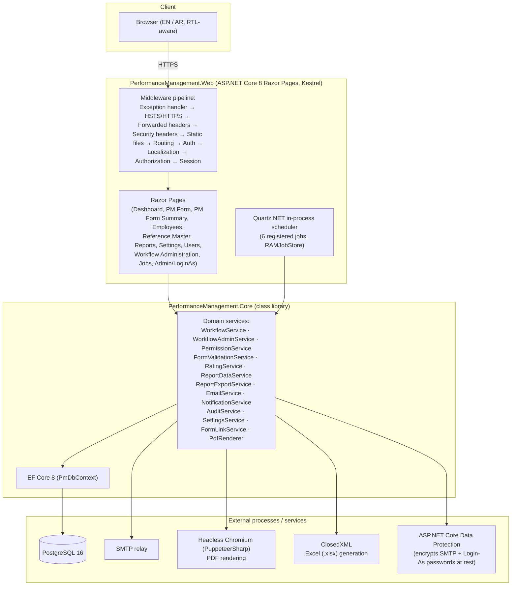
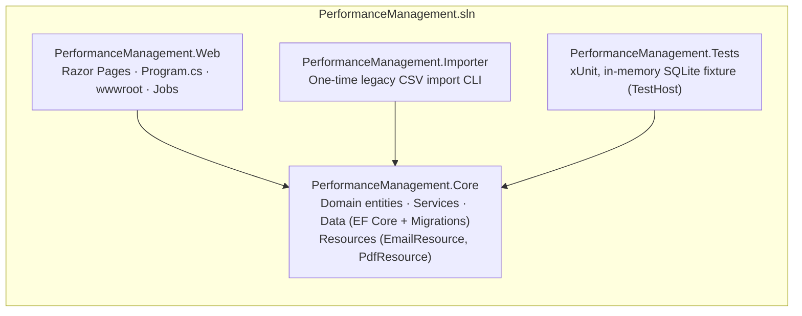
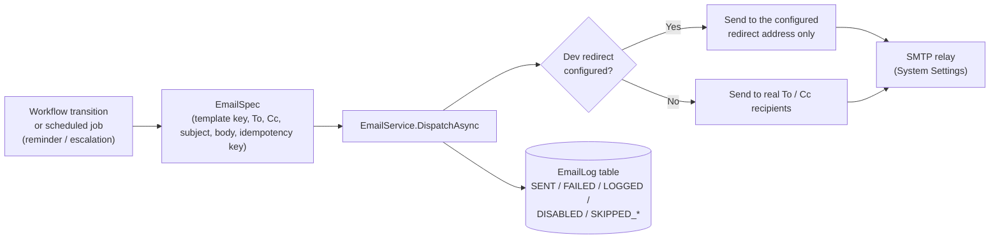
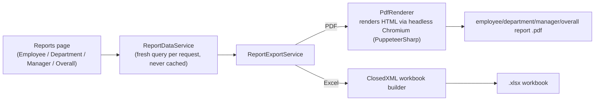

# System & Layer Architecture

## System architecture

## Layer architecture & project dependencies

*Dependency direction is strictly one-way: `Web` and `Importer` both depend on `Core`; `Core` has no dependency back on either. `Core` contains all business logic and is the only project the automated test suite exercises directly.*

## Email pipeline

## Reporting pipeline (PDF / Excel)

