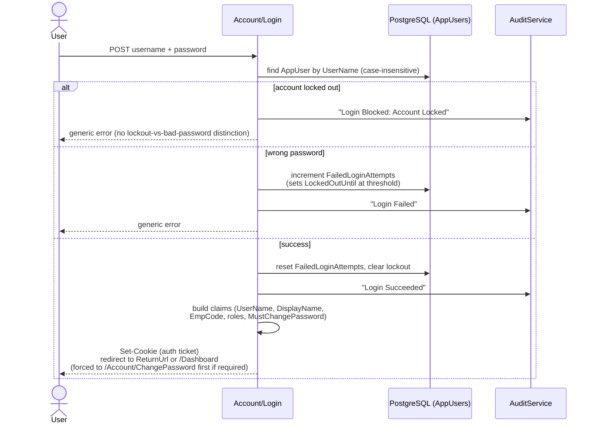
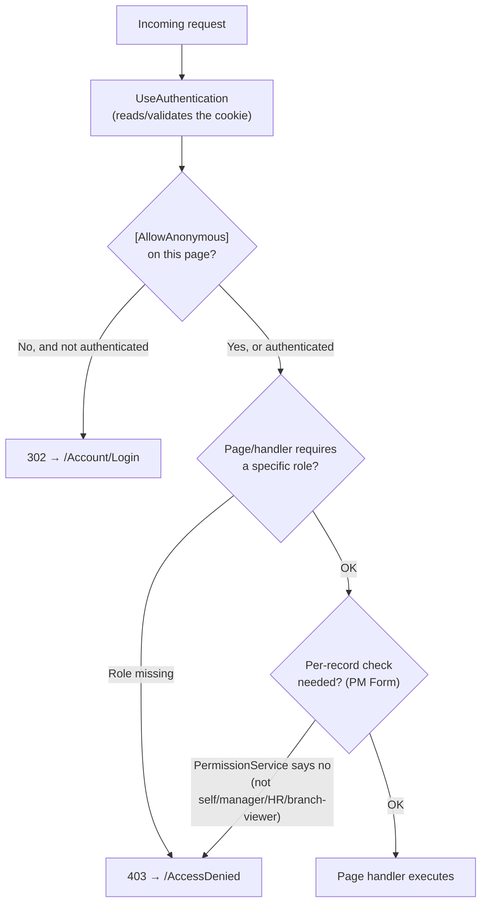
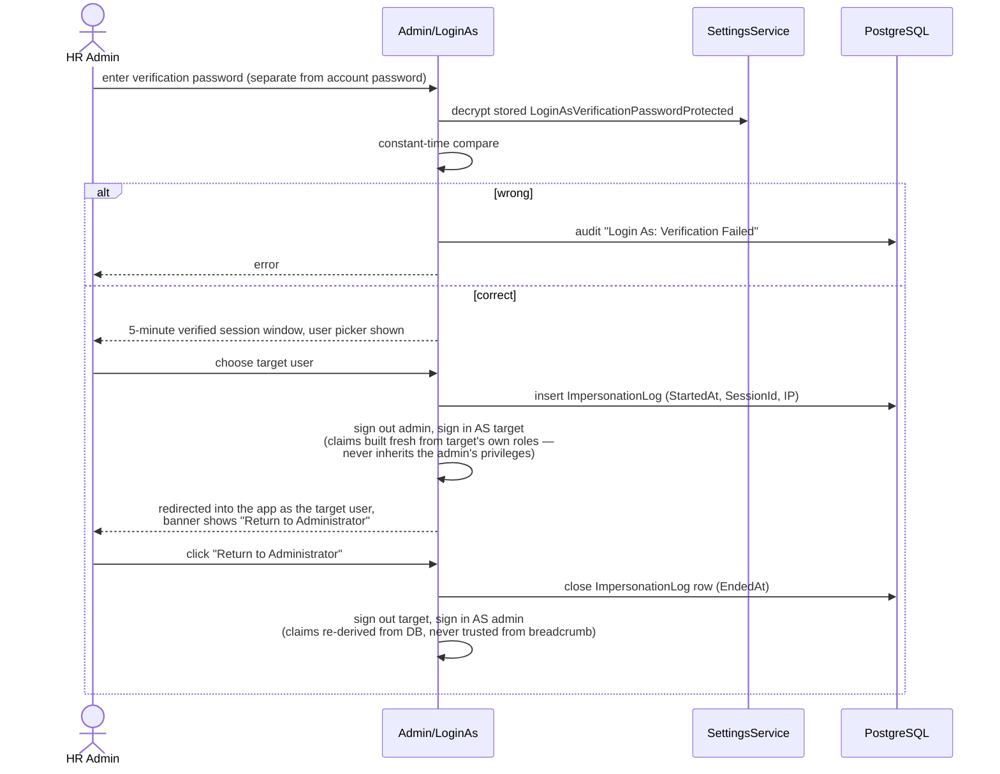

# Authentication & Authorization Flow

Cookie-based authentication (`Microsoft.AspNetCore.Authentication.Cookies`), two roles
(`HR_ADMIN`, `VIEWER` — any authenticated user without either role is treated as a regular
employee/manager), and a global fallback policy requiring authentication on every page not
explicitly marked `[AllowAnonymous]`.

## Login sequence

## Per-request authorization

*Role gating is declarative (`[Authorize(Roles = Roles.HrAdmin)]` or
`HrAdminOrViewer`) on Settings, Users, Jobs, Workflow Administration, Reference Master, Reports,
and Admin/LoginAs. PM Form's per-record authorization is additionally evaluated in code via
`PermissionService.GetFormPermissionsAsync`, since "can this user act on this specific
employee's form" depends on the manager-assignment table, not a static role.*

## "Login As" impersonation

