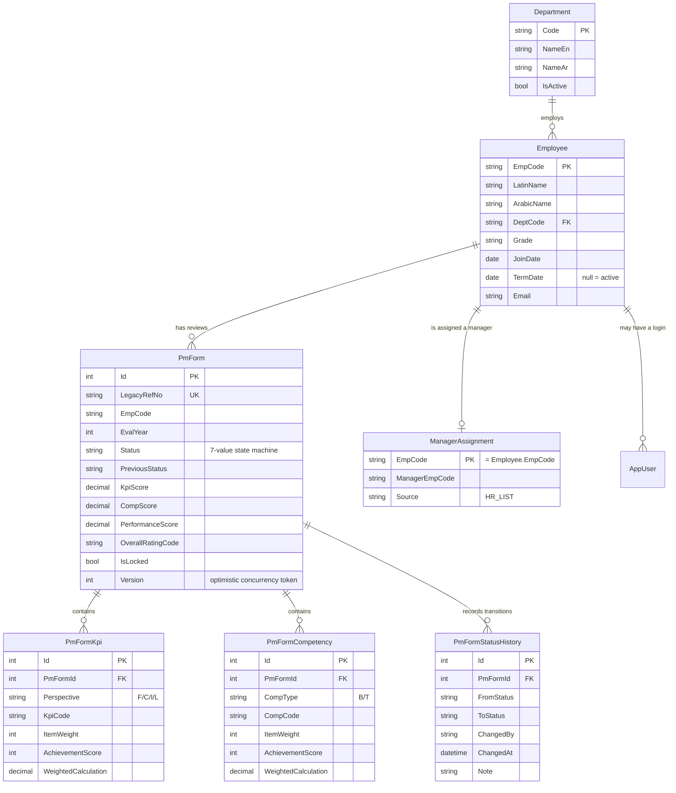

# Database ER Diagrams

PostgreSQL 16, 22 tables via EF Core 8 (`PmDbContext`), 11 migrations. Split into two diagrams
for legibility: the PM workflow core, and reference/master/system data.

## PM workflow core

*`PmForm(EmpCode, EvalYear)` carries a unique index — at most one review per employee per year.
Name/department/designation/grade fields on `PmForm` are deliberate point-in-time snapshots
(`EmpNameSnapshot`, `DeptCode`, `GradeSnapshot`, …), not live foreign keys — a review must always
read back the way it looked when it was actually reviewed, even if the employee later transfers
departments or is renamed.*

## Reference data, users, and system tables

```mermaid
erDiagram
    AppUser ||--o{ UserRole : "has roles (HR_ADMIN / VIEWER)"
    KpiMaster ||--o{ PmFormKpi : "referenced by code"
    CompetencyMaster ||--o{ PmFormCompetency : "referenced by code"
    JobFamily ||--o{ Employee : "grade maps to KPI/Comp split"

    KpiMaster {
        string KpiId PK
        string Name
        string Perspective "F/C/I/L"
        string DeptCsv "* or comma list"
        int MinWeight
        int MaxWeight
        string Status
    }
    CompetencyMaster {
        string CompId PK
        string CompType "B/T"
        int MinWeight
        int MaxWeight
    }
    JobFamily {
        string Code PK
        string GradesCsv
        int KpiWeight
        int CompWeight
    }
    RatingScale {
        string Code PK
        int MinScore
        int MaxScore
    }
    EmployeeException {
        int Id PK
        string EmpCode
        string RuleCode "PERSPECTIVE_MIN_EXEMPT / KPI_50_50 / SELF_MANAGER / BRANCH_VIEWER"
        date EffectiveFrom
        date EffectiveTo
    }
    AppUser {
        int Id PK
        string UserName UK
        string PasswordHash
        string EmpCode FK
        int FailedLoginAttempts
        datetime LockedOutUntil
        string PreferredCulture
    }
    UserRole {
        int Id PK
        int AppUserId FK
        string Role
    }
    SystemSettings {
        int Id PK "singleton, = 1"
        string SmtpHost
        string SmtpPasswordProtected "Data-Protection encrypted"
        string DevelopmentRedirectEmail
        bool EnableAuditLogging
        int MaxLoginAttempts
        int AccountLockoutMinutes
    }
    EmailLog {
        int Id PK
        string TemplateKey
        string Status "SENT/FAILED/LOGGED/DISABLED/SKIPPED_*"
        string IdempotencyKey
    }
    AuditLog {
        int Id PK
        datetime OccurredAt
        string Action
        string PerformedBy
        string EntityType
        string EntityId
    }
    ImpersonationLog {
        int Id PK
        string AdminUserName
        string ImpersonatedUserName
        datetime StartedAt
        datetime EndedAt
        guid SessionId
    }
    ScheduledJobRun {
        int Id PK
        string JobName
        datetime StartedAt
        string Status "RUNNING/SUCCEEDED/FAILED"
    }
    Notification {
        int Id PK
        string UserName
        string Type
        bool IsRead
    }
```

## Key indexes

| Table | Index | Purpose |
|---|---|---|
| `PmForms` | `(EmpCode, EvalYear)` unique | One review per employee per year |
| `PmForms` | `(EvalYear, Status)` | Workflow Administration / PM Form Summary search |
| `AuditLogs` | `(EntityType, EntityId)` | Per-record audit history (Workflow Administration Details) |
| `AuditLogs` | `OccurredAt`, `EmpCode`, `DeptCode`, `Action` | Audit filtering |
| `ManagerAssignments` | `ManagerEmpCode` | "My team" / manager-filtered searches and reports |
| `AppUsers` | `UserName` unique | Login lookup |
| `EmailLogs` | `IdempotencyKey`, `FormLegacyRefNo` | Duplicate-send prevention, per-form email history |
