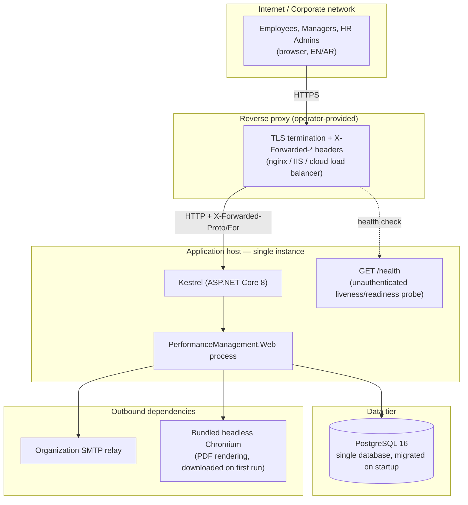
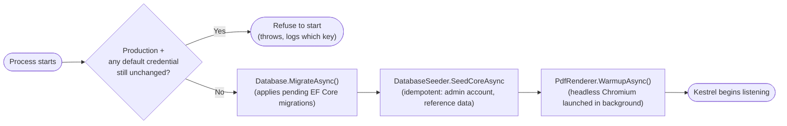

# Deployment Architecture

The application is a **single-node deployment by design** — session/cache state is in-process
memory and the Quartz scheduler uses the default in-memory `RAMJobStore` (no clustering
configured). See [Deployment_Guide.pdf](../Deployment_Guide.pdf) for the full checklist; this
diagram shows the intended topology.

## Startup sequence

## Environments

| Environment | HTTPS redirect / HSTS | Cookie `Secure` | Exception page | Notes |
|---|---|---|---|---|
| Development | Off | `SameAsRequest` | Developer exception page | Matches `.claude/launch.json`'s plain `http://localhost` dev server |
| Production | On | `Always` | Generic `/Error` page (EN/AR) | `ASPNETCORE_ENVIRONMENT=Production` |

## Single-node constraint

Do **not** run multiple replicas of this application without first: moving session/distributed
cache to a shared store, switching Quartz to a clustered/persistent `JobStore` (otherwise every
replica runs every scheduled job independently — duplicate annual-form generation, duplicate
reminder emails), and moving `Database.MigrateAsync()` out of app startup into a single, explicit
release step.
