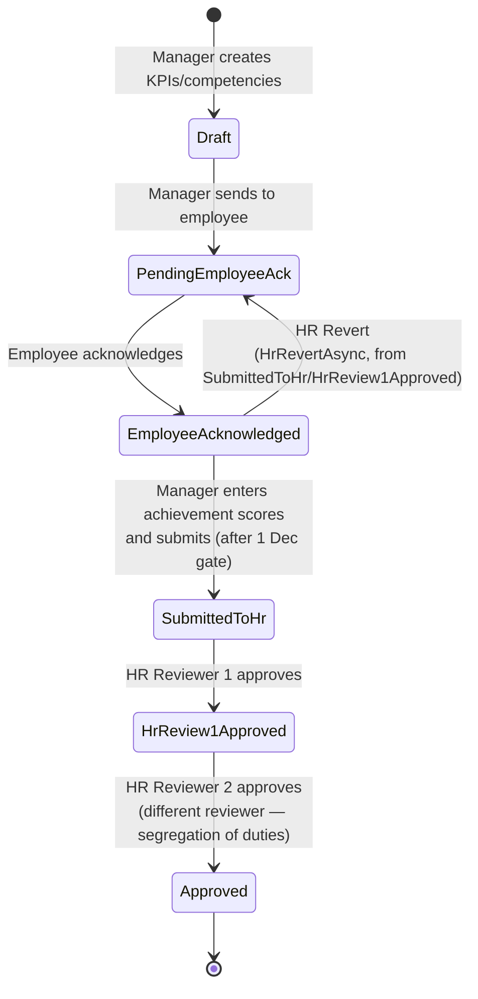
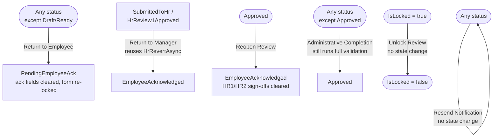
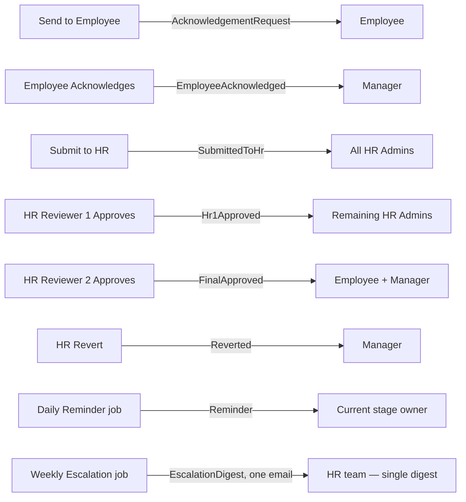

# Workflow State Machine

The annual PM review cycle is a linear, seven-status state machine (`PmFormStatus`). Five of the
seven statuses are reachable through the normal Manager → Employee → Manager → HR → HR flow;
`Ready` is a legacy status accepted on read but never written by the current app.

## Normal lifecycle

## Workflow Administration overrides

Six recovery actions, HR-Admin-only, each requiring a mandatory typed reason, each producing an
audit-log entry and a `PmFormStatusHistory` row:

## State → stage/owner mapping (Workflow Administration UI)

| `PmFormStatus` | Displayed stage | Current owner | Tracker ordinal |
|---|---|---|---|
| `Draft` / `Ready` | KPI Creation | Manager | 0 |
| `PendingEmployeeAck` | Employee Acknowledgement | Employee | 1 |
| `EmployeeAcknowledged` | Manager Review | Manager | 2 |
| `SubmittedToHr` | HR Review — First | HR | 3 |
| `HrReview1Approved` | HR Review — Final | HR | 3 |
| `Approved` | Completed | — | 4 |

## Notifications by transition

